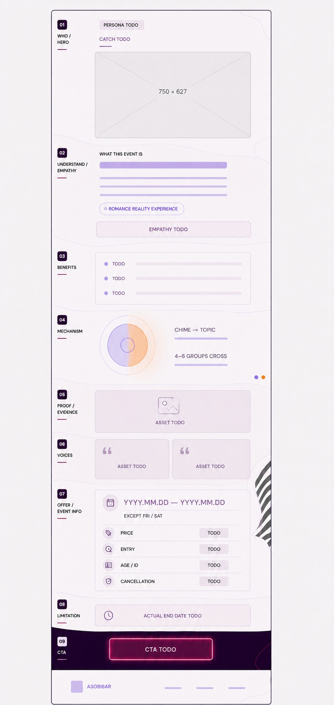
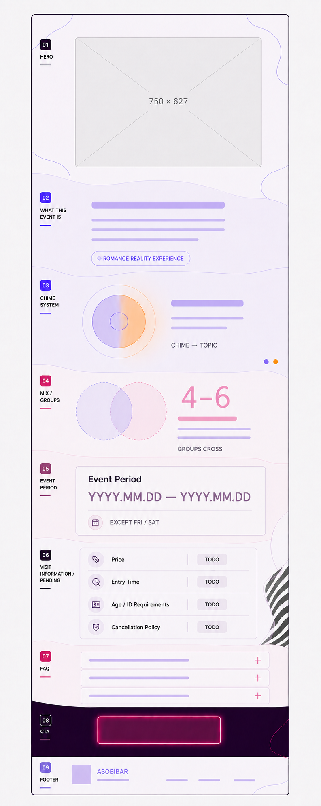
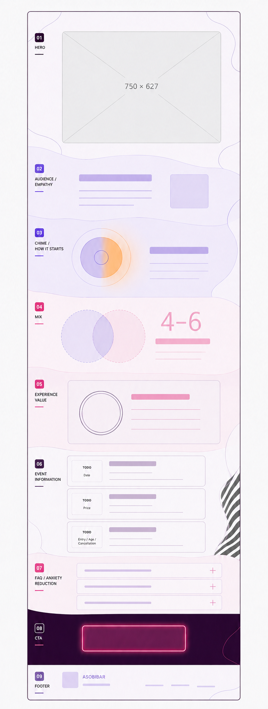
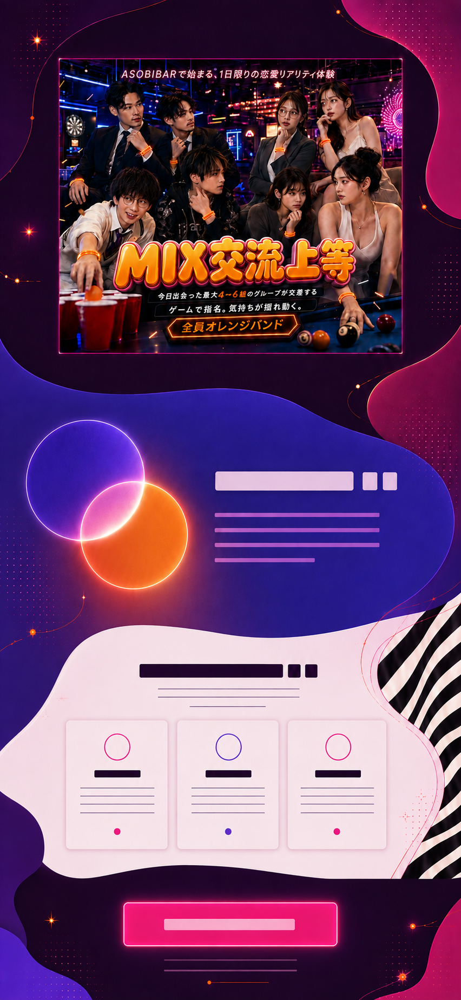
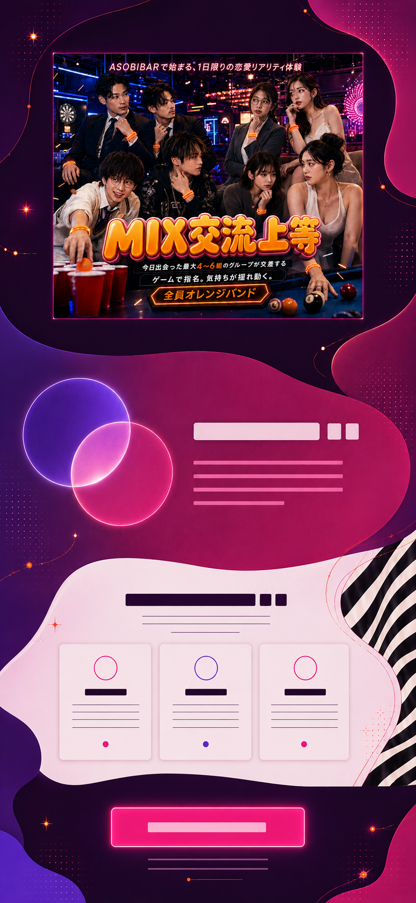
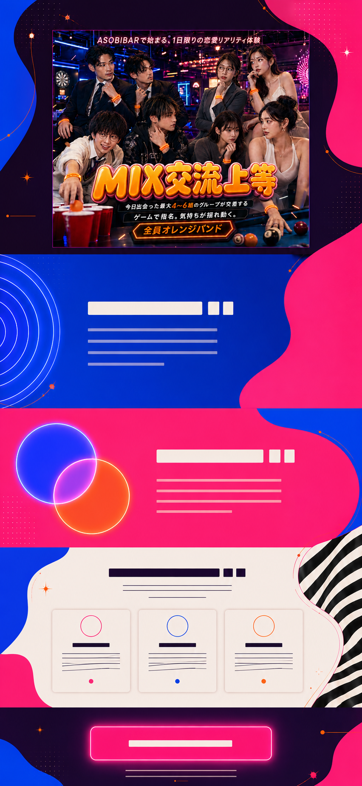
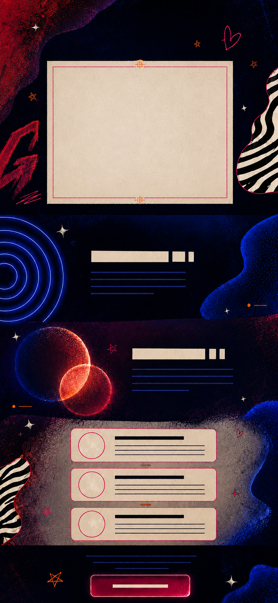
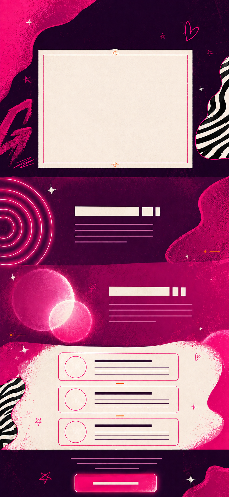
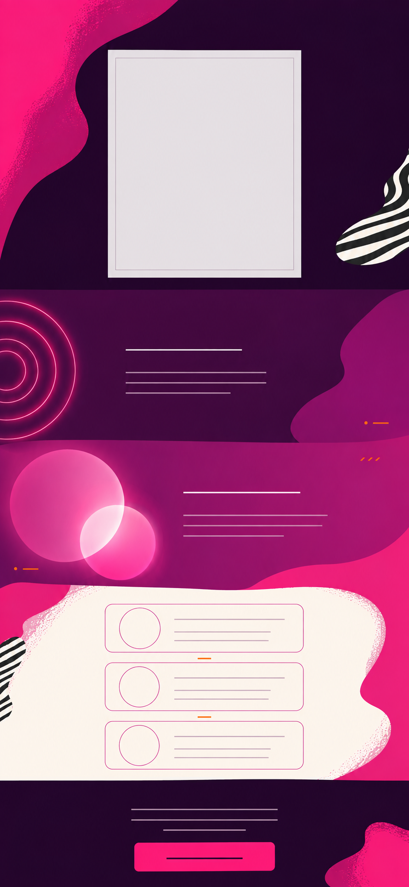
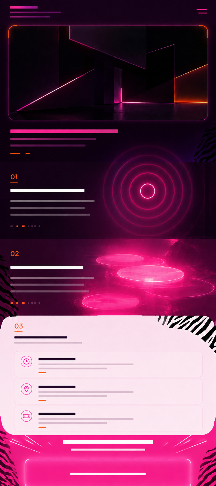

# コードを書く前のLP設計

- **Date:** 2026-09-07
- **Status:** 2026-09-08の内容カンプ09を作成。配色方向は比較06。構成ベースはSOUND TRIP。リボンは不採用。支給バナーは仮置き
- **対象:** ミックス交流上等バンド単独LP
- **参照:** `harness/scenarios/design-comp.yaml`、`harness/contracts/mix-lp.yaml`、
  `docs/design-docs/reference-sites.md`

## 目的

カンプHTMLを書く前に、LPの情報構造と視覚上の役割を決める。
この文書で未決定になっている項目は、コピーや装飾で隠さず、依頼者確認後に決める。

## 内容構成第一稿（現在）

2026-09-08の依頼者回答を反映した現在の内容構成は
`docs/design-docs/content-structure-first-draft.md`を正とする。

**WHO / HERO → 共感・イベント理解 → 得られる体験 → 仕組み → 開催情報 → CTA**

- 対象は20〜30代の男女
- 来店前の期待は、いつもと違う刺激、関係が動くきっかけ、非日常
- 恋愛リアリティショーをASOBIBARで行っている
- 開催期間は2026年10月1日〜10月31日
- 参加条件はオレンジバンド
- 料金、受付時間、店舗一覧は載せない
- 実績・証拠、お客さまの声は素材がないため外す
- 独立した限定性は置かず、終了日を開催情報に含める
- CTAで店舗選択ダイアログを開き、選んだ店舗の公式LINEへ移動する

## 内容ファネル・ワイヤーフレーム 10（回答反映前）

- **ファイル:** `design/mix-lp-content-funnel-wireframe-10.png`
- **サイズ:** 864 × 1821px
- **基準:** 375px幅の縦積み
- **状態:** 依頼者提示の構成へ、確定事実と未確定枠を対応させたワイヤーフレーム。HTML・Sass・JSには未反映
- **構成参照:** `design/references/content-funnel-order-reference.png`

依頼者提示の「誰に？→キャッチ→共感・理解→メリット→実績・証拠→お客さまの声→
オファー→限定性→CTA」を、ページの説得順として採用する。
参照画像の色、角丸のピル、黄色い矢印はデザインとして流用しない。

### 必須訴求3点

依頼者指定により、次の3語は本番LPの読める文字として必ず掲載する。

1. **恋愛リアリティ体験**
2. **最大4〜6組**
3. **日〜木曜日限定**

支給バナーへ焼き込まれた文字だけには頼らない。SPでは小さい文字が読めないため、
FV直下に3点の短い要約を置き、後続セクションでもそれぞれの文脈で説明する。
同じ3語を大見出しとして何度も反復せず、最初は全体像、後続では理解を深める役割に分ける。

| 掲載位置 | 表示する語 | 役割 |
| --- | --- | --- |
| FV直下 | 恋愛リアリティ体験／最大4〜6組／日〜木曜日限定 | 画像を読めない状態でもイベントの輪郭を把握できる短い要約 |
| 02 共感・理解 | 恋愛リアリティ体験 | イベントの位置づけを伝える |
| 04 仕組み | 最大4〜6組 | 複数グループが交差する規模を伝える |
| 07 開催情報 | 日〜木曜日限定 | 参加できる曜日を伝える。日付確定後は「開催期間中」を併記する |

「1日限り」はHTMLの限定訴求に使わない。開始日・終了日が未確定の間は、
「日〜木曜日限定」から通年開催を連想させないよう、開催期間のTODO枠と同じ面に置く。

### MIX LPへの対応

| | 参考構成 | MIX LPで置くもの | 状態 |
| --- | --- | --- | --- |
| 01 | 誰に？・キャッチ | ペルソナの短い呼びかけ、仮バナー、必須訴求3点の短い要約、キャッチコピー | 必須訴求3点のみ確定。ペルソナ・コピーは未決定 |
| 02 | 共感・理解 | イベント概要、「恋愛リアリティ体験」という位置づけ、共感文 | 位置づけのみ確定。共感文は未決定 |
| 03 | 得られるメリット | 参加後に得られる価値を3点以内 | 未決定。ペルソナ確定後に作る |
| 04 | 商品理解の根拠 | チャイムからお題が出る／「最大4〜6組」が交差する | 2点とも確定事実 |
| 05 | 実績・証拠 | 実績値、掲載実績、運営実績などの支給素材 | 素材なし。支給がなければ節ごと外す |
| 06 | お客さまの声 | 実在する参加者の声 | 素材なし。支給がなければ節ごと外す |
| 07 | オファー | 開催期間、「日〜木曜日限定」、料金・入店条件 | 曜日条件のみ確定。ほかは`TODO(依頼者確認)` |
| 08 | 限定性 | 実際の終了日または締切 | 未確定。「1日限り」や架空の残席は使わない |
| 09 | 行動喚起 | 単一CTA | CV、遷移先、文言は未決定 |

05と06はページに必ず置く前提ではない。ワイヤーフレーム上の枠は必要素材を確認するためのもので、
素材が来なければ空欄やダミーを公開せず、次の節を詰める。08も事実として使える終了日が
決まらなければ外す。FooterはCTAの後ろへ番号なしで置く。

### イベント概要のカード切り替え

02のイベント概要は、FUTURE TRAINのVisitor Guide / Future Imagination Courseで見られる
「選択肢のレールと、同じ枠で切り替わる詳細パネル」を構造の参考にする。MIXでは次の3枚を
固定順で置く。

1. `WHAT IS MIX` — ASOBIBARで行う恋愛リアリティ体験
2. `CHIME` — チャイムが鳴ると、そこからお題が出される
3. `CROSS` — 最大4〜6組のグループが交差する

カンプでは3枚の情報量と読む順番を確認し、実装段階で横送り・スワイプへ変換する。概要内に
予約ボタンは置かず、公式LINEへの単一CTAはページ末尾に残す。自動再生はせず、次カードの端を
少し見せて続きがあることを伝える。実装前の仕様は `docs/design-docs/overview-motion-spec.md`
にまとめた。

## 内容ワイヤーフレーム 09（構成変更前）

- **ファイル:** `design/mix-lp-content-wireframe-09.png`
- **サイズ:** 793 × 1983px
- **基準:** 375px幅の縦積み
- **状態:** 確定事実をどの順で伝えるかを確認するワイヤーフレーム。HTML・Sass・JSには未反映

依頼者の指示により、ファーストビューの次を
**イベント概要 → チャイムの仕組み → 4〜6組が交差する特徴 → 開催期間**の順にした。
以前の「共感」セクションは、ペルソナと流入文脈が未確定のため先頭から外している。

### 入れる情報

| | 役割 | 表示する内容 | 状態 |
| --- | --- | --- | --- |
| 01 FV | イベント名を一致させる | 支給バナーを750:627で仮置き | 最終キーアート未決定 |
| 02 イベント概要 | 何のイベントか理解させる | 見出し案「ミックス交流上等バンドとは」／「最大4〜6組のグループが交差する、ASOBIBARの恋愛リアリティ体験。」 | 見出しは仮。本文は確定事実のみ |
| 03 チャイム | 仕組みを一つだけ伝える | 見出し案「チャイムが鳴る」／「チャイムが鳴ると、そこからお題が出されます。」 | 見出しは仮。本文は確定事実 |
| 04 MIX | このイベント固有の構造を伝える | 見出し案「4〜6組が交差する」／「最大4〜6組のグループが交差します。」 | 見出しは仮。本文は確定事実 |
| 05 開催期間 | 参加できる時期を伝える | 「金・土以外は、開催期間中ずっと開催。」／開始日〜終了日は`TODO(依頼者確認)` | 条件は確定。具体日付は未確定 |
| 06 参加情報 | 判断に必要な条件を並べる | 料金、入店時刻、年齢・本人確認、キャンセル規定 | すべて`TODO(依頼者確認)` |
| 07 FAQ | CTA直前の不安を減らす | 店舗回答から必要な質問だけ作る | 未確定 |
| 08 CTA | 一つの行動へ進める | CV、遷移先、ボタン文言 | 未確定 |
| 09 Footer | 運営主体を示す | ASOBIBAR、必要な法的表記 | 法的表記は未確定 |

画像上の英語はレイアウトを識別するラベルで、本番コピーではない。
実際の日本語は上の表を正として扱い、確定していない効果・結果・進行を足さない。

## モバイルワイヤーフレーム 08（構成元）

- **ファイル:** `design/mix-lp-mobile-wireframe-08.png`
- **サイズ:** 771 × 2038px
- **基準:** 375px幅の縦積み
- **状態:** 情報の順番と面の役割を確認するワイヤーフレーム。HTML・Sass・JSには未反映

01 FV、02 ペルソナへの共感、03 チャイム、04 MIX、05 体験価値、06 開催情報、
07 FAQ、08 CTA、09 Footerの9区間で組んだ。支給バナーは750:627の比率だけを示す
仮置き枠にし、焼き込み文字の上へ別の見出しを重ねない。

未確定のため中身を入れていない箇所:

- 02はペルソナと流入文脈が決まるまで、見出しと本文の量だけを示す
- 06は確定している開催条件だけを想定し、料金・入店・年齢確認・キャンセル規定をTODO枠にする
- 07は店舗回答が揃うまで、質問数と回答文を決めない
- 08は単一CVと遷移先が決まるまで、ボタンの文言と固定表示を決めない

外周の薄い線は最終装飾ではなく、専用SVGが入る領域のガイド。
オレンジは03の補色パルスだけに置き、06の情報カードからは外した。
05の円もモチーフ未決定を示す中立的な枠で、ハートなどの意味を固定していない。

## オレンジを補色で使う配色比較 07（比較用の記録）

- **ファイル:** `design/mix-lp-orange-complement-color-study-07.png`
- **サイズ:** 852 × 1846px
- **用途:** オレンジを飾りとして散らさず、補色関係が見える1場面へ割り当てる
- **状態:** 2026-09-07にワイヤーフレームへ進めた案。2026-09-08に比較06へ戻す判断が出た

オレンジの相手になる青系を、ページ全体ではなくチャイムの場面だけに置く。
深いブルーバイオレット `#3435B8` の面へ、タンジェリンオレンジ `#FF8A1F` の
光を一度だけ重ね、**チャイムが鳴って空気が切り替わる瞬間**として見せる。

オレンジはこの光が主役で、ほかの面には2〜3個の小さな点や短い罫としてだけ反復する。
CTAはネオンピンクのままにし、オレンジへ行動の役割を持たせない。
これにより、ピンクとオレンジがページ全体で競う状態を避けながら、補色の高揚感を1箇所へ作る。

## 色の競合を整理した配色比較 06（採用方向）

- **ファイル:** `design/mix-lp-cohesive-neon-color-study-06.png`
- **サイズ:** 852 × 1846px
- **用途:** 比較05で競合した青・ピンク・オレンジを、1本のネオン配色へ整理する
- **状態:** 2026-09-08、依頼者が最も良いと判断。内容カンプ09へ反映

比較05の違和感は、純度の高い青・ピンク・オレンジが同じ強さと面積で主張し、
サイバーゲームの配色に寄っていたこと。比較06では広いコバルトブルーを外し、
**濃紫 `#24102E` → 電気的な紫 `#6338D4` → ラズベリーピンク `#C91F70`**を
主な流れにした。ネオンピンク `#FF2D95` はCTAと細線、オレンジ `#FF8A1F` は点だけに残す。

この案では、セクションごとに主役色を1色へ絞り、明暗差で高揚感を作る。
MIXは紫とラズベリーピンクの光が重なる1場面だけにし、オレンジの大きな円は置かない。

## ワクワク感を強めた配色比較 05（見直し前）

- **ファイル:** `design/mix-lp-exciting-color-study-05.png`
- **サイズ:** 852 × 1847px
- **用途:** バナーの色へページ全体を従わせず、ページ側だけで期待感が続く色面を比較する
- **状態:** 見直し前の比較案。支給バナーをFVへ仮置きする判断だけ確定

比較04は支給バナーとの色の連続性を優先したため、濃紺の面積が広く落ち着いて見えた。
比較05では、夜の濃紫で始まり、電気的な青とネオンピンクの広い面を交互に切り替える。
オレンジは面にせず、光の交差、罫、火花のような小面積に限定する。
白とスモーキーピンクは情報カードの休止面だけに残す。

ワクワク感は装飾の数ではなく、**暗い面から明るい色面へ切り替わる落差**と、
青・ピンクの光が一度だけ重なる場面で作る。外周は配置確認用の筆跡ではなく、
SOUND TRIPを参考にした滑らかな有機形として描いている。

支給バナーは構成と占有面積を確認するための仮素材で、最終キーアートではない。
実装検討時に仮置きする場合は生成画像内の再現を切り出さず、支給ファイルそのものを使う。
最終的に残すか、別素材で組み直すかは未決定。

## バナー基準の配色比較 04（未確定）

- **ファイル:** `design/mix-lp-banner-aligned-color-study-04.png`
- **サイズ:** 853 × 1844px
- **用途:** 構成を変えず、バナーとの色の連続性だけを比較する
- **状態:** 検討案。依頼者確認前なので配色決定とハーネスは変更しない

支給バナーとカンプ03を同条件で縮小して色相を集計した。

| | 青系 | マゼンタ | 暗部 | 明部 |
| --- | ---: | ---: | ---: | ---: |
| 支給バナー | 23.9% | 11.1% | 43.8% | 16.9% |
| カンプ03 | 0.2% | 42.0% | 21.6% | 45.7% |

カンプ03はマゼンタと白い面が広すぎ、バナーの青い店内光と暗い写真面をほぼ持っていない。
比較04では濃紺と黒紫を大面積、青い光を中面積、ピンクをCTAと線、
オレンジを短いマークへ絞った。SOUND TRIPから取った構成は変えていない。

比較04の外周にあるざらついた筆跡は、色面の位置を確認するための仮表現。
**実装時の外周はSOUND TRIPのように滑らかで明確な輪郭へ仕上げる。**

## 静止デザインカンプ 03（比較元）

- **ファイル:** `design/mix-lp-yankee-neon-visual-comp-03.png`
- **サイズ:** 852 × 1846px
- **用途:** コードへ移す前に、完成時の質感・図形・余白・視線の流れを判断する
- **実装状況:** HTML・CSSには未反映

SOUND TRIPから取った有機的な構成へ、ヤンキーネオンの質感を加えた。
広い紫の地、境界へ食い込むピンクの形、端だけのゼブラ、チャイムの同心円、
大小の光だまり、同じ輪郭の情報カード、濃紫へ戻るCTA面を1本のページとしてつないでいる。

FV中央の白い面は支給キーアートの配置領域で、実寸比750 × 627pxに合わせた横長比率。
支給画像そのもの、本文、CTA文言はまだ入れていない。

## 方向確認用の静止カンプ 02（構成検討）

- **ファイル:** `design/mix-lp-sound-trip-structure-direction-02.png`
- **サイズ:** 852 × 1846px
- **用途:** SOUND TRIPから取った構成文法を、MIXの紫〜ピンクへ置き換えて確認する
- **実装状況:** HTML・CSSには未反映

### このカンプで確認すること

- FVを暗い1画面として扱い、中央のキーアート領域を空けている
- 直線の区切りを避け、大きな有機形を次の面へ食い込ませている
- 本文は中央、小さなゼブラやチャイムの光は端へ寄せている
- MIXの面は大1＋小1の光だまりを対にしている
- 情報面は同じ輪郭の3カードを1列で反復している
- 終盤はFVと同じ濃紫へ戻り、ネオンピンクのCTAだけを中央へ置いている
- SOUND TRIPのシアン、赤、ロゴ、人物、SVG輪郭は流用していない

### このカンプでは決めないこと

- FVの白い矩形は支給キーアートの場所を示すだけ。実装時は支給画像へ置き換える
- 本文は文字量の目安を示す線だけ。コピーは未決定
- 3枚のカードは同種情報の反復を示す。項目数や内容は未決定
- CTAの文言、遷移先、固定表示の採否は単一CVの確定後に決める

## 方向確認用の静止カンプ 01（構成更新前）

- **ファイル:** `design/mix-lp-yankee-neon-direction-01.png`
- **サイズ:** 836 × 1881px
- **用途:** 実装前に、色面・ゼブラ柄・情報密度・セクション順を確認する
- **実装状況:** HTML・CSSには未反映

この画像を作ったあと、依頼者から `on-the-trip.com/sound-trip` を構成ベースにする指示が出た。
そのため、**カンプ01から残すのは配色の役割と、リボンを使わない判断だけ。**
セクション境界、図形の大小、余白、CTAの閉じ方は次の静止カンプで組み直す。

### このカンプで確認すること

- 暗い紫からネオンピンクへ下る色の変化
- リボンを使わず、チャイムを同心円状の光で示す構成
- MIXを複数の光だまりが重なる面で示す構成
- ゼブラ柄を外周だけに置き、本文の背面へ入れない配分
- 情報カードをSPで1列に積む構成
- 最後のCTA面だけを大きなネオンピンクのべた塗りにする構成

### このカンプでは決めないこと

- FVの抽象画像は支給キーアートの代替プレースホルダー。実装用素材ではない
- 本文は文字量の目安を示す線だけ。コピーは未決定
- アイコンの形は仮で、採用を決めていない
- キーアート、CTA文言、店舗情報、FAQは未確定

支給キーアートを生成画像へ直接合成する試行は画像生成側の自動判定で止まったため、
この静止カンプでは同じ比率のプレースホルダーに置き換えた。
仮置きするときは生成し直さず、リポジトリにある支給画像をそのまま配置する。
最終キーアートとして採用するかは未決定。

## 参照サイトから採用するもの

### KBC創立70周年

リボンの形は採用しない。今後、浮遊する装飾を置く場合に限り、動きの考え方を採用する。

- 配置・動き・絵を3層に分ける
- 動きの振幅は要素自身の±3〜5%に抑える
- durationは1.8〜2.9秒の範囲でそれぞれ変え、delayは0にする
- `alternate-reverse`で位相が揃わない状態を作る
- 動かす物体は未決定。ヤンキーネオンの世界観と関係のない飾りは置かない
- キーアートの焼き込み文字には動く装飾を重ねない

KBCのリボン素材、写真素材、固有レイアウトは流用しない。

### FUTURE TRAIN

採用するのは、端点を決めて中間色を補間し、ページ全体の色を1本の流れにする考え方。
Next.js、Three.js、シェーダなどの実装は採用しない。

| 段階 | 色 | 設計上の役割 |
| --- | --- | --- |
| 01 | `#24102E` | FVとCTAの夜色 |
| 02 | `#5B163F` | 仕組みを説明する暗い面 |
| 03 | `#8D1B58` | 境界の有機形 |
| 04 | `#C91F70` | イベント理解の広い光 |
| 05 | `#E52683` | ネオンの線や小面積 |
| 06 | `#FF2D95` | CTAのべた塗り専用 |

`#FF8A1F`はランプへ入れず、チャイム場面で`#3435B8`と補色になる光へ一度だけ使う。
ほかでは罫・番号などの小面積に限定する。
スモーキーピンクと白いカードは、本文を読むための静かな面としてランプの外に置く。

比較05では、ワクワク感を強める候補として電気的な青 `#214CFF` を広い面へ加えている。
これは既存ランプへ追加確定した色ではない。採用する場合は、紫→青→ピンクを1本の流れとして
組み直し、近い役割の中間色を減らしてからハーネスのランプ値を更新する。

### SOUND TRIP

ページ構成の基準として採用する。色や固有の素材は移さず、次の組み方を借りる。

- FVを1画面の強い色面にする
- 1色の広い地へ、隣接色の巨大な有機形を1つ置く
- 有機形を次のセクションへ10〜25%食い込ませ、境界を直線で切らない
- 本文の中央を空け、装飾は左右端・四隅・境界へ寄せる
- 1セクションの図形は「大1＋小1」を基本単位にする
- 同種情報は同じカードまたは円形フォーマットで反復する
- 終盤でFVの濃紫へ戻し、CTAを独立した面として閉じる

元サイトのシアン、赤、ロゴ、人物イラスト、SVGの輪郭は流用しない。
このLPでは既存の紫〜ピンクのランプ、ゼブラ柄、チャイムの光をこの構造へ割り当てる。

## 確定している内容

イベントの核として記載できる事実は次の4点。

1. 最大4〜6組のグループが交差する
2. 日〜木曜日限定（開催期間中）
3. チャイムが鳴り、そこからお題が出される
4. 恋愛リアリティ体験と言ってよい

2026-09-08に追加された掲載情報は次のとおり。

- 対象は20〜30代の男女
- 来店前の期待は「いつもと違う刺激」「関係が動くきっかけ」「非日常」
- 恋愛リアリティショーをASOBIBARで行っている
- 開催期間は2026年10月1日〜10月31日
- 参加条件はオレンジバンド
- 全店開催だが、店舗一覧は載せない
- 恋愛リアリティ体験とASOBIBARでの感動体験を価値として伝える
- CTAは店舗選択ダイアログを経由し、選んだ店舗の公式LINEへ移動する

料金と受付時間は一旦掲載しない。実績とお客さまの声もないためセクションを外す。
イベントのお題や進行の中身は、意図的に説明しない。

## LP全体の一手

ページ全体を貫く表現は
「深夜のド派手なピンクとゼブラの女子部屋で、チャイムの光が空気を切り替える」。

世界観は**ヤンキーカルチャーのネオン**へ寄せる。
ハイギャルのラグジュアリー、マスタード主体、ゴールドの光沢は採用しない。
ゼブラ柄、ネオン、暗い紫からピンクへ変わる色面で一つの夜を作る。

「MIX」はリボンではなく、別々だった光の領域がチャイムを境に重なり、
ページ下部へ進むほどピンクの熱量が上がる変化で表す。
4〜6組という数は本文で正確に伝え、装飾の個数へ無理に置き換えない。

## 情報構造

順番は、ユーザーがページを読み進める理由で決める。
ワイヤーフレームでは支給待ちの節を条件付きで置いてよいが、本番では空欄やダミーを公開しない。

| 順番 | 面 | 役割 | 掲載できる内容 | 決めてから入れるもの |
| --- | --- | --- | --- | --- |
| 1 | 誰に？・FV | 対象者と流入先が正しいことを伝える | 20〜30代の男女、仮置きの支給バナー、イベント名、必須訴求3点 | 流入広告との一致、最終キーアート |
| 2 | 共感・イベント理解 | 何のイベントか理解させる | ASOBIBARで行う恋愛リアリティショー | 最終コピーの調整 |
| 3 | メリット | 自分にどんな価値があるか伝える | いつもと違う刺激、関係が動くきっかけ、非日常 | 保証表現にならない最終コピー |
| 4 | 仕組み | 主張が成立する仕組みを示す | チャイムからお題が出る、最大4〜6組が交差する | 事実を超えない説明文、図形の配置 |
| 5 | オファー・開催情報 | 参加条件を静かに読ませる | 2026年10月1日〜31日、日〜木曜日限定、オレンジバンド | なし |
| 6 | CTA | 単一の行動へ進める | 「参加する店舗を選ぶ」→店舗選択ダイアログ→店舗の公式LINE | 店舗名と各公式LINE URL |
| - | Footer | 運営主体を示す | ASOBIBAR | 必要な法的表記とリンク |

### SOUND TRIPを基準にした画面の骨格

| 範囲 | 組み方 | このLPで置くもの |
| --- | --- | --- |
| FV〜イベント理解 | 1画面の暗色面から広い単色面へつなぐ | 仮バナー、対象者、キャッチ、イベント概要 |
| メリット〜仕組み | 大きな形1つと反対側の小さな形1つ | 3点以内のメリット、チャイムの補色パルス、4〜6組 |
| 開催情報 | 白い情報カードで判断材料をまとめる | 2026年10月1日〜31日、日〜木曜日限定、オレンジバンド |
| CTA〜Footer | FVの濃紫へ戻し、中央に単一の行動を置く | 店舗選択ボタンと、公式LINEへつなぐ店舗選択ダイアログ |

セクション数は情報の役割で決め、SOUND TRIPのセクション名や順番はコピーしない。
「How To」の4円構成も、未確定のイベント進行を4段階に見せるためには使わない。

### 読み進めたときの感情

| 段階 | ユーザーの状態 | ページが返すもの |
| --- | --- | --- |
| 誰に？・FV | 自分向けで、見た広告の続きか確認する | 20〜30代の男女への呼びかけ、同じイベント名と仮バナー |
| 共感・理解 | 何のイベントか理解する | ASOBIBARで体験する恋愛リアリティショー |
| メリット | 自分に参加する理由があるか判断する | いつもと違う刺激、関係が動くきっかけ、非日常 |
| 仕組み | その価値がどう成立するか確かめる | チャイムとお題、4〜6組が交差する構造 |
| 開催情報 | 参加可能か現実的に判断する | 2026年10月1日〜31日、日〜木曜日限定、オレンジバンド |
| CTA | 参加する店舗を決める | 店舗選択ダイアログと、各店舗の公式LINEへの導線 |

## 10要素の採否

| 基本要素 | 状態 | 方針 |
| --- | --- | --- |
| キャッチコピー | 第一稿あり | 3つの来店前の期待に合わせて最終調整する |
| 権威づけ | 不採用 | 実績素材がないためセクションを置かない |
| メインビジュアル | 仮置き | `img/mix-band-key.webp`。最終採用は未決定 |
| よくある悩み | 未決定 | ペルソナ決定前は書かない |
| ベネフィット | 第一稿あり | いつもと違う刺激、関係が動くきっかけ、非日常の3点。カップル成立を保証しない |
| 商品情報 | 一部のみ | 確定した核4点、開催期間、参加条件を掲載する。料金と受付時間は載せない |
| 優位性 | 候補あり | チャイムとお題、複数グループの交差。比較表現は作らない |
| お客様の声 | 不採用 | 素材がないためセクションを置かない |
| FAQ | 第一稿では不採用 | 店舗の正式回答がないためセクションを置かない |
| CTA | 方向確定 | 「参加する店舗を選ぶ」でダイアログを開き、選んだ店舗の公式LINEへ移動する |

独立した限定性セクションは置かず、10月31日の終了日を開催情報に含める。
「1日限り」、架空の残席、根拠のないカウントダウンは使わない。

## 面の設計

### 強い面

- FVは`#24102E`の1画面とし、検討中は支給バナーを中央へ仮置きする
- 各区間では広い地1色と、隣接するランプ色の巨大な有機形1つで面を作る
- 「MIX」の面で、大小1組の光の領域を左右交互に重ねる
- 終盤はFVの濃紫へ戻し、CTAボタンだけへ`#FF2D95`の最大彩度を割り当てる
- 発光を使う場合はFVとCTAの2箇所以内に限定する

### 読ませる面

- 開催情報、FAQ、注意書きは白または大理石調のカードに載せる
- ゼブラ柄を本文の背景にしない
- 本文へ装飾書体やゴールドのグラデーション文字を使わない
- 強い面の間へ配置し、色彩ノイズをリセットする

### 柄と装飾

- ゼブラ柄はキーアート外周か、端から食い込む有機形の一部へクリップし、本文の背面へ敷かない
- 別の動物柄や新しいネオン色は加えない
- オレンジは罫、番号、短いマークに限定する
- 角丸は2種類以内にする

### 外周形状の作り方（実装時）

- 有機形の輪郭はセクション専用SVGで作る。CSSの大きな`border-radius`だけで済ませない
- CSSは位置、サイズ、色、重なり、レスポンシブ切り替えを担当する
- SVGは外形、ゼブラのクリップ、必要な内側の質感を担当する
- 外周の輪郭は滑らかで切れ目のない面にし、ざらつきは必要な場合だけ形の内側へ薄く閉じ込める
- PCとSPで本文へ干渉する場合は、SOUND TRIPと同じく別の配置用SVGへ切り替える
- 参考サイトの輪郭そのものは写さず、このLP用の形を作る
- 375pxとPC幅の描画で、輪郭のジャギー、意図しない切れ、横スクロールを目視する

## キーアートの扱い

支給バナーにはロゴとコピーが焼き込まれている。2026-09-07の依頼者判断で、
現段階ではFVの仮置き素材として扱う。

- 支給物を使う場合、HTML側で同じイベント名やロゴを重ねない
- ネオンやゼブラ柄をキーアート中央の文字へ重ねない
- SPで約8pxになる焼き込み文字のうち、判断に必要な事実だけを後続HTMLで再掲する
- 文字なし素材が支給された場合に限り、HTMLでの再構成を検討する

最終判断は「支給物をそのままFVに残す」か「別素材で再構成する」か。
配色は支給バナーへの一致だけで決めず、バナーを外した状態でもページ側に高揚感が残るように組む。

## 文字設計

- 375px幅で日本語見出しは24pxを上限にする
- 見出し、ラベル、キャッチコピー、CTAには句点と読点を付けない
- 本文には句点を付け、読点の代わりに半角スペースを使う
- 法的文言は支給原文を変更しない
- 和文見出しは使用書体を決めた後に字間を目で調整する
- PCでも本文カラムをむやみに広げず、余白は外周の装飾に使う

## 動きの設計

動きを必須にはしない。浮遊する装飾を採用する場合は、ネオン管の光片や
女子部屋の輪郭として意味が通る物体を静止画で先に決めてから動かす。

| 層 | 責任 |
| --- | --- |
| 配置層 | セクション内の位置、サイズ、重なり |
| 動き層 | 振幅、duration、easing、反復 |
| 絵の層 | ネオン装飾の形、線幅、光、色 |

すべての浮遊物を同じ物理法則に従わせる。
`prefers-reduced-motion: reduce`では停止させ、情報の欠落を起こさない。

## レスポンシブ設計

- 最初の基準幅は375px
- 見出しの改行、キーアート内文字、カード余白を375pxで先に確認する
- タップ領域は44px以上
- PCはSPの本文カラムを広げず、外側にネオンの線やゼブラ柄の余白を展開する
- 外周装飾のはみ出しが横スクロールを生まないことを確認する
- 全景だけで判断せず、FV、MIX、開催情報、CTAを個別に描画して見る

## コードを書く前の制作順

1. 単一CV、ペルソナと流入文脈、目標CVRを決める
2. ヤンキーネオンの中で、色の面積配分とゼブラ柄の位置を決める
3. 支給バナーを仮置きした状態と外した状態の両方で配色を確認する
4. コピーなしの面積配分図で、色と静かな面の割合を確認する
5. テキストだけの情報設計で、セクション順と欠ける要素を確認する
6. 375pxの静止ワイヤーで、情報量と改行を確認する
7. PC幅の静止ワイヤーで、本文カラムと外周装飾を確認する
8. MIXを表す光の重なりと、必要なら浮遊物の形を決める
9. 静止画として承認された後に、浮遊の動きを加える
10. 決定内容をこの文書へ反映してからカンプをコード化する

## 決定が必要な項目

優先順。上が決まらないまま下を決めない。

1. **単一CV:** 予約、来店、SNSフォローのどれか
2. **ペルソナと流入文脈:** どの広告・投稿から、何を期待して来る人か
3. **目標CVR:** 単価と想定流入に基づく数値
4. **キーアート:** 支給物をそのまま使う、または文字なし素材を待つ
5. **MIXの表現:** 光の領域をどの形・面積で重ねるか
6. **浮遊物:** 採用するか。採用する場合は何を表す形にするか
7. **店舗回答:** 開催期間、料金、入店、年齢確認、キャンセル規定
8. **公開先:** ドメイン、`og:url`、`og:image`

## カンプへ進む条件

次の項目が揃うまで、カンプHTMLと本番デザインは書かない。

- 単一CVが決まっている
- ペルソナと流入文脈が1文で書ける
- 目標CVRがある
- ヤンキーネオンの面積配分が決まっている
- キーアートの扱いが決まっている
- セクション順と欠かす要素の理由が合意されている

## 決定ログ

### 2026-09-07

- 世界観は「ヤンキーカルチャーのネオン」へ寄せる
- ハイギャルのラグジュアリー方向は採用しない
- リボンは採用しない方向で設計を進める。最終確定までは既存素材を削除しない
- MIXの代替表現は、暗い紫からピンクへ移る光の領域の重なりを第一候補にする
